# Solar Cell Simulation

<!-- TABLE OF CONTENTS -->

  
<h2 style="display: inline-block">Table of Contents</h2>

  <ul>
    <li><a href="#overview-and-purpose">Overview and Purpose</a></li>
    <li><a href="#usage">Usage</a></li>
    <li><a href="#I---semiconductor-parameters">I - Semiconductor Parameters</a></li>
      <ul>
        <li><a href="#1---thermal-voltage">1 - Thermal Voltage</a></li>
        <li><a href="#2---bandgap">2 - Bandgap</a></li>
        <li><a href="#3---effective-carrier-masses">3 - Effective Carrier Masses</a></li>
        <li><a href="#4---chemical-potential">4 - Chemical Potential</a></li>
        <li><a href="#5---intrinsic-carrier-concentrations">5 - Intrinsic Carrier Concentrations</a></li>
        <li><a href="#6---carrier-mobilities">6 - Carrier Mobilities</a></li>
        <li><a href="#7---diffusion-coefficients">7 - Diffusion Coefficients</a></li>
      </ul>
    <li><a href="#II---two-diode-model">II - Two-Diode-Model</a></li>
    <li><a href="#III---measurement-data">III - Measurement Data</a></li>
    <li><a href="#conventions">Conventions</a></li>
    <li><a href="#future">Future</a></li>
    <li><a href="#software-versions">Software Versions</a></li>
    <li><a href="#license">License</a></li>
  </ul>

## Overview and Purpose

In this repository you'll find Python modules for <!-- a fully-fledged --> the comprehensive simulation (calculation and plotting) of
- Silicon Semiconductor Parameters
- Current density-voltage characteristics J(U)
- Power-voltage characteristics P(U)
- Specific solar cell characteristics Uoc, Jsc, UMPP, JMPP, SMPP, FF, η

All papers used during the code creation are referenced here and in the sources (exception: triviality).
   

## Usage

1. Clone repo and set it as src folder (add PATH) so that the modules can access each other.

2. Make sure your environment fulfills the requirements (see <a href="#software-versions">Software Versions</a>)

3. Play around
 

e.g.:
- Use [whatever].py in your own simulation projects
- Use [parameter]_exampleplot.py to directly calculate and create graphs of the desired parameter
- Use twodiodemodel_exampleplot.py (contains usage instructions in docstring) to directly calculate and create graphs of the current density-voltage characteristic J(U)
   

## I - Semiconductor Parameters

### 1 - Thermal Voltage

- Implementation of the standard definition

<!-- 
as used in the Two-Diode-Model (or e.g. the Shockley diode equation) 
-->

<pre>
&nbsp;&nbsp;&nbsp;&nbsp;&nbsp;&nbsp;&nbsp;&nbsp; 
&nbsp;&nbsp;&nbsp;&nbsp;&nbsp;&nbsp;&nbsp;&nbsp; 
</pre>

<figure>
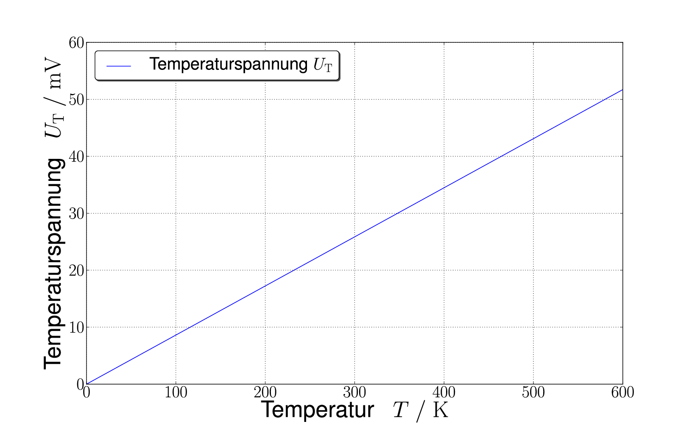
</figure>
 

### 2 - Bandgap

- Implementation of several empiric and semi-empiric models from the following papers
    - R. Pässler, "Dispersion-Related Description of Temperature Dependencies of Band Gaps in Semiconductors", Physical Review B, vol. 66, no. 8, pp. 85201–1–85201–18, 2002
    - R. Pässler, "Parameter Sets Due to Fittings of the Temperature Dependencies of Fundamental Bandgaps in Semiconductors", Physica Status Solidi (b), vol. 216, no. 2, pp. 975–1007, 1999
    - A. Schenk, "Finite-Temperature Full Random-Phase Approximation Model of Band Gap Narrowing for Silicon Device Simulation", Journal of Applied Physics, vol. 84, no. 7, pp. 3684–3695, 1998
    - M. A. Green, "Silicon Solar Cells: Advanced Principles & Practice", Centre for Photovoltaic Devices and Systems, University of New South Wales, 1995
    - R. Vankemmel, W. Schoenmaker, and K. De Meyer, "A Unified Wide Temperature Range Model for the Energy Gap, the Effective Carrier Mass and Intrinsic Concentration in Silicon", Solid-State Electronics, vol. 36, no. 10, pp. 1379–1384, 1993
    - M. A. Green, "Intrinsic Concentration, Effective Densities of States, and Effective Mass in Silicon", Journal of Applied Physics, vol. 67, no. 6, pp. 2944–2954, 1990
    - F. H. Gaensslen and R. C. Jaeger, "Temperature Dependent Threshold Behavior of Depletion Mode MOSFETs: Characterization and Simulation", Solid-State Electronics, vol. 22, no. 4, pp. 423–430, 1979
    - C. D. Thurmond, "The Standard Thermodynamic Functions for the Formation of Electrons and Holes in Ge, Si, GaAs and GaP", Journal of the Electrochemical Society, vol. 122, no. 8, pp. 1133–1141, 1975
    - W. Bludau, A. Onton, and W. Heinke, "Temperature Dependence of the Band Gap of Silicon", Journal of Applied Physics, vol. 45, no. 4, pp. 1846–1848, 1974
    - Y. P. Varshni, "Temperature Dependence of the Energy Gap in Semiconductors", Physica, vol. 34, no. 1, pp. 149–154, 1967
    - J. Bardeen and W. B. Shockley, "Deformation Potentials and Mobilities in Non-Polar Crystals", Physical Review, vol. 80, no. 1, pp. 72–80, 1950

- Implementation of experimental data from the following papers
    - M. A. Green, "Intrinsic Concentration, Effective Densities of States, and Effective Mass in Silicon", Journal of Applied Physics, vol. 67, no. 6, pp. 2944–2954, 1990
    - W. Bludau, A. Onton, and W. Heinke, "Temperature Dependence of the Band Gap of Silicon", Journal of Applied Physics, vol. 45, no. 4, pp. 1846–1848, 1974
    - G. G. MacFarlane, T. P. McLean, J. E. Quarrington, and V. Roberts, "Fine Structure in the Absorption-Edge Spectrum of Si", Physical Review, vol. 111, no. 5, pp. 1245–1254, 1958

<figure>
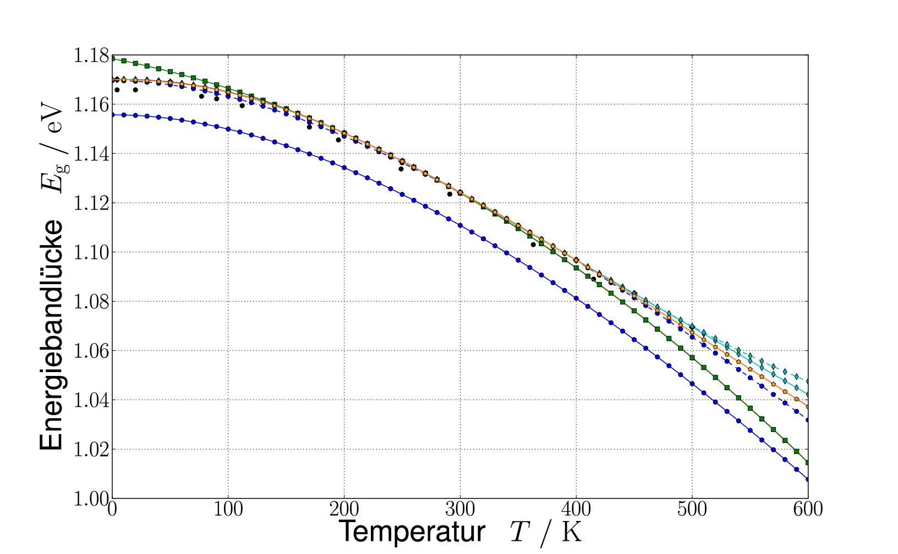
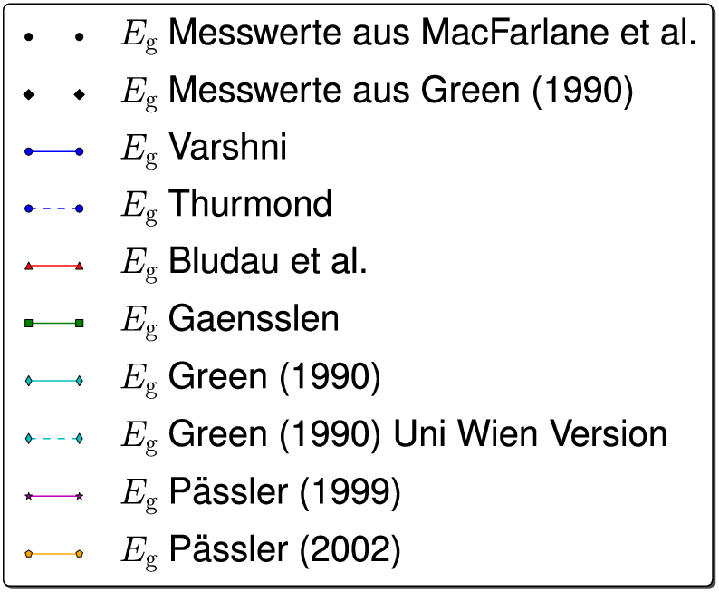
</figure>
 

### 3 - Effective Carrier Masses

- Implementation of the semi-empiric model from
    - M. A. Green, "Intrinsic Concentration, Effective Densities of States, and Effective Mass in Silicon", Journal of Applied Physics, vol. 67, no. 6, pp. 2944–2954, 1990

<figure>

</figure>
 

### 4 - Chemical Potential

- Implementation of the standard definition for the deviation from the bandgap center
    - for temperature independent effective carrier masses m = m(300 K)
    - for temperature dependent effective carrier masses m = m(T)

<pre>
&nbsp;&nbsp;&nbsp;&nbsp;&nbsp;&nbsp;&nbsp;&nbsp; 
&nbsp;&nbsp;&nbsp;&nbsp;&nbsp;&nbsp;&nbsp;&nbsp; 
</pre>

<figure>
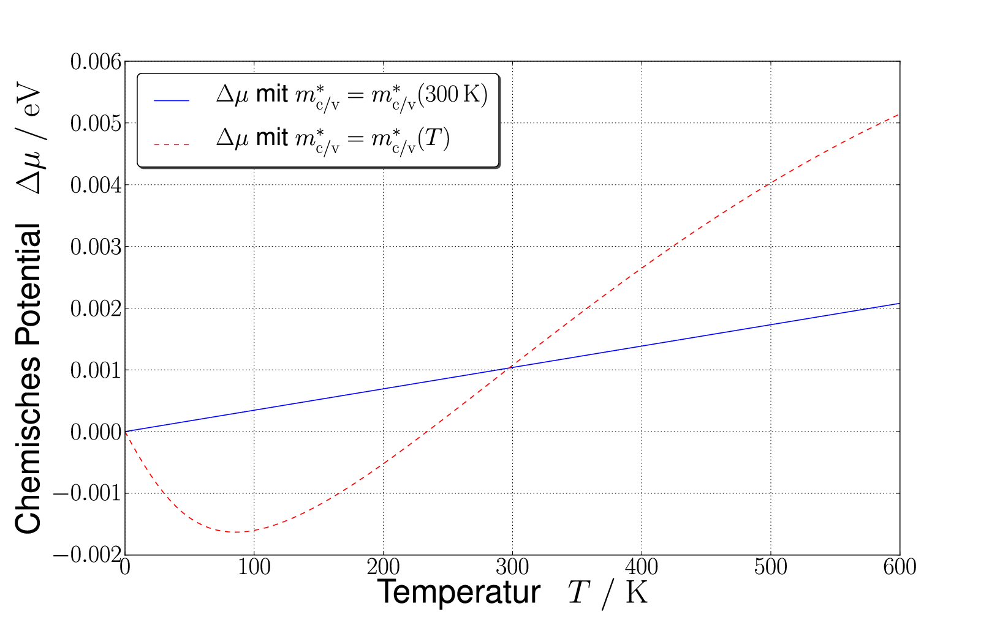
</figure>
 

### 5 - Intrinsic Carrier Concentrations

- Implementation of several empiric and semi-empiric models from the following papers:
    - A. Kimmerle, "Herstellung und Charakterisierung hochohmiger Emitter für Hocheffizienzsolarzellen", Diplomarbeit, Albert-Ludwigs-Universität Freiburg im Breisgau, 2011
    - K. Misiakos and D. Tsamakis, "Accurate Measurements of the Silicon Intrinsic Carrier Density from 78 to 340 K", Journal of Applied Physics, vol. 74, no. 5, pp. 3293–3297, 1993
    - A. B. Sproul and M. A. Green, "Intrinsic Carrier Concentration and Minority-Carrier Mobility of Silicon from 77 to 300 K", Journal of Applied Physics, vol. 73, no. 3, pp. 1214–1225, 1993
    - A. B. Sproul and M. A. Green, "Improved Value for the Silicon Intrinsic Carrier Concentration from 275 to 375 K", Journal of Applied Physics, vol. 70, no. 2, pp. 846–854, 1991
    - M. A. Green, "Intrinsic Concentration, Effective Densities of States, and Effective Mass in Silicon", Journal of Applied Physics, vol. 67, no. 6, pp. 2944–2954, 1990
    - T. Wasserrab, "Die Temperaturabhaengigkeit der elektronischen Kenngroeszen des eigenleitenden Siliciums", Zeitschrift für Naturforschung A, vol. 32a, pp. 746-749, 1977
    - J. W. Slotboom, "The pn-Product in Silicon", Solid-State Electronics, vol. 20, no. 4, pp. 279–283, 1977
    - H. D. Barber, "Effective Mass and Intrinsic Concentration in Silicon", Solid-State Electronics, vol. 10, no. 11, pp. 1039–1051, 1967
    - E. H. Putley and W. H. Mitchell, "The Electrical Conductivity and Hall Effect of Silicon", Proceedings of the Physical Society, vol. 72, no. 2, pp. 193–200, 1958
    - F. J. Morin and J. P. Maita, "Electrical Properties of Silicon Containing Arsenic and Boron", Physical Review, vol. 96, no. 1, pp. 28–35, 1954

- Implementation of experimental data from the following papers:
    - P. P. Altermatt, A. Schenk, F. Geelhaar, and G. Heiser, "Reassessment of the Intrinsic Carrier Density in Crystalline Silicon in View of Band-Gap Narrowing", Journal of Applied Physics, vol. 93, no. 3, pp. 1598–1604, 2003
    - K. Misiakos and D. Tsamakis, "Accurate Measurements of the Silicon Intrinsic Carrier Density from 78 to 340 K", Journal of Applied Physics, vol. 74, no. 5, pp. 3293–3297, 1993

<figure>
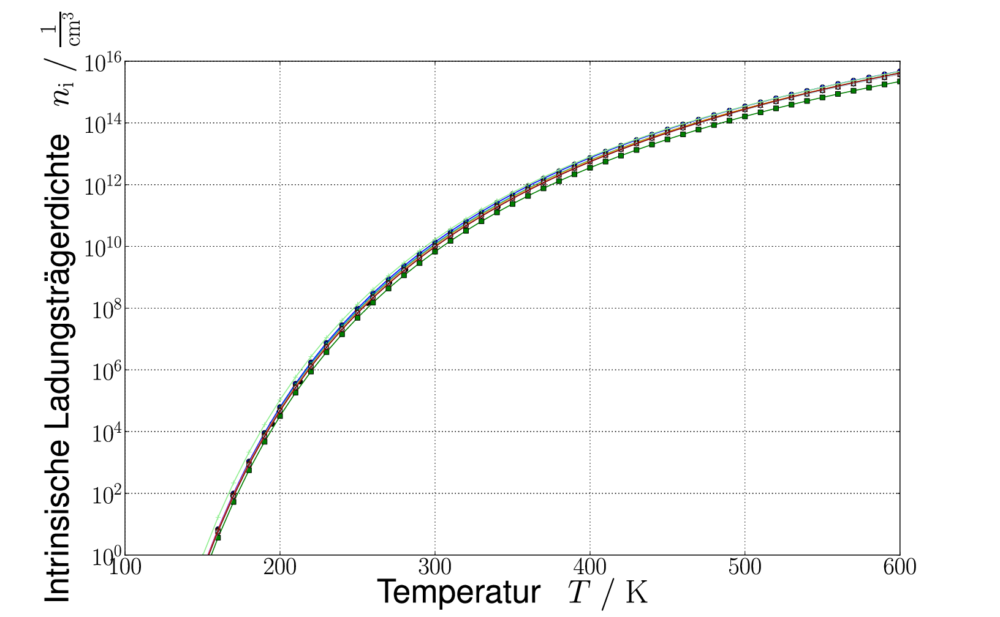
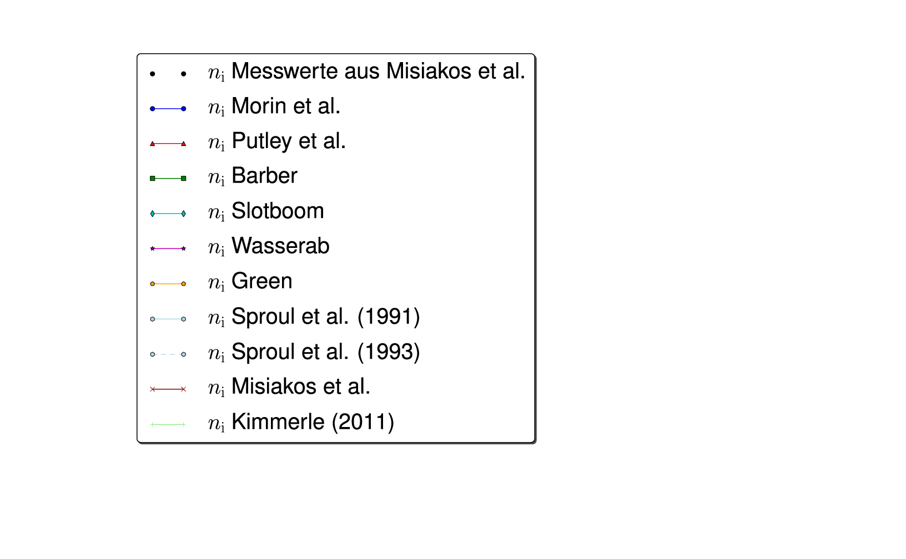
</figure>
 

### 6 - Carrier Mobilities

- Implementation of the model from
    - D. B. M. Klaassen, "A Unified Mobility Model for Device Simulation – I. Model Equations and Concentration Dependence", Solid-State Electronics, vol. 35, no. 7, pp. 953–959, 1992
    - D. B. M. Klaassen, "A Unified Mobility Model for Device Simulation – II. Temperature Dependence of Carrier Mobility and Lifetime", Solid-State Electronics, vol. 35, no. 7, pp. 961–967, 1992

<figure>
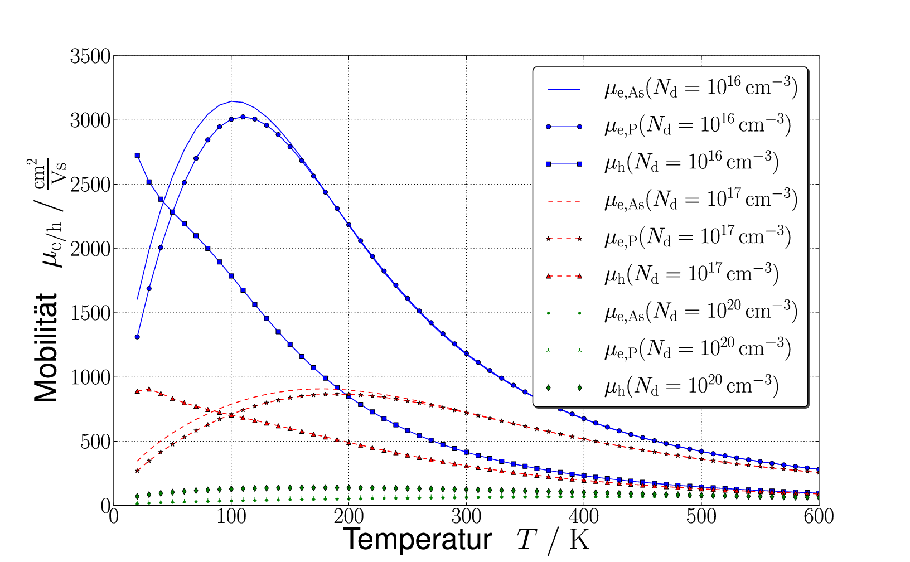
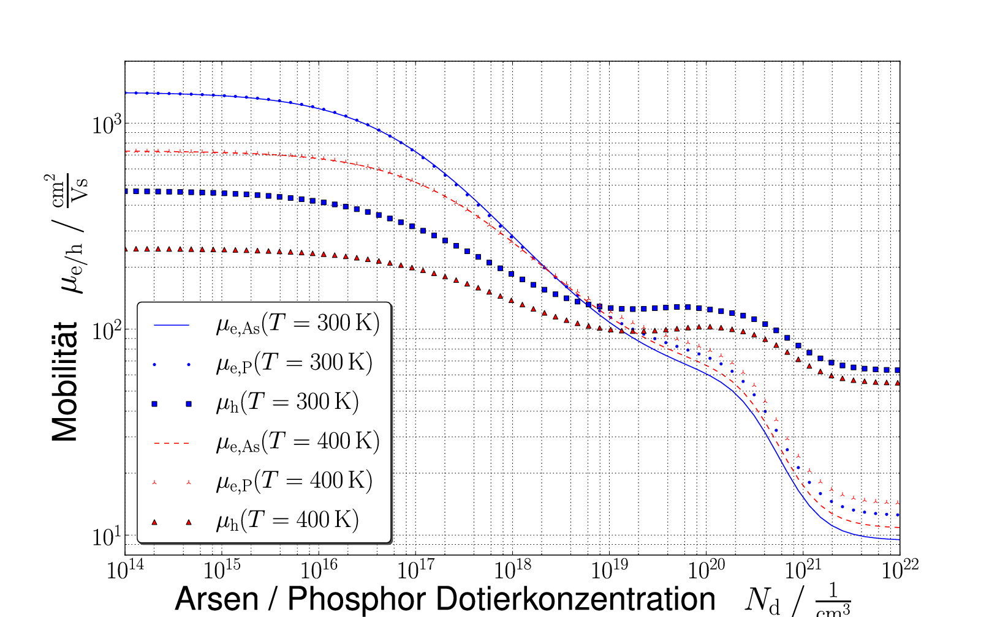
<figcaption>N-type silicon carrier mobilities (left) temperature dependent with doping concentration as parameter and (right) doping concentration dependent with temperature as parameter.</figcaption>
</figure>
<figure>
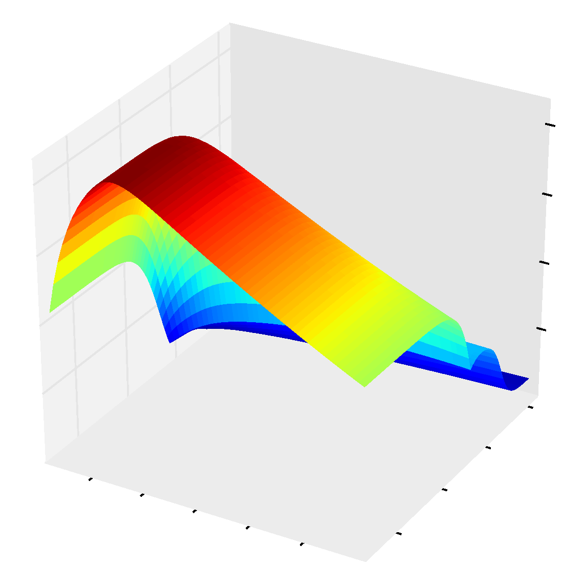
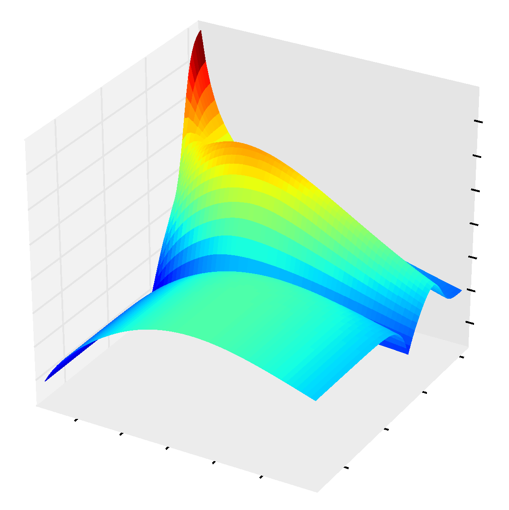
<figcaption>3D Graph of n-type silicon (left) temperature and As-doping dependent electron mobilities and (right) temperature and As-doping dependent hole mobilities.</figcaption>
</figure>
<figure>
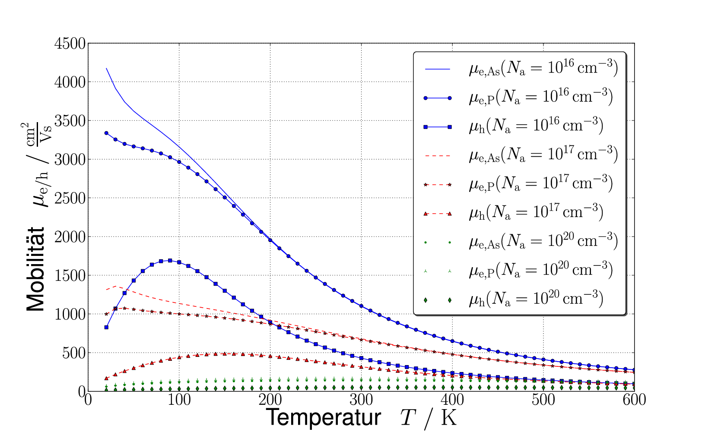
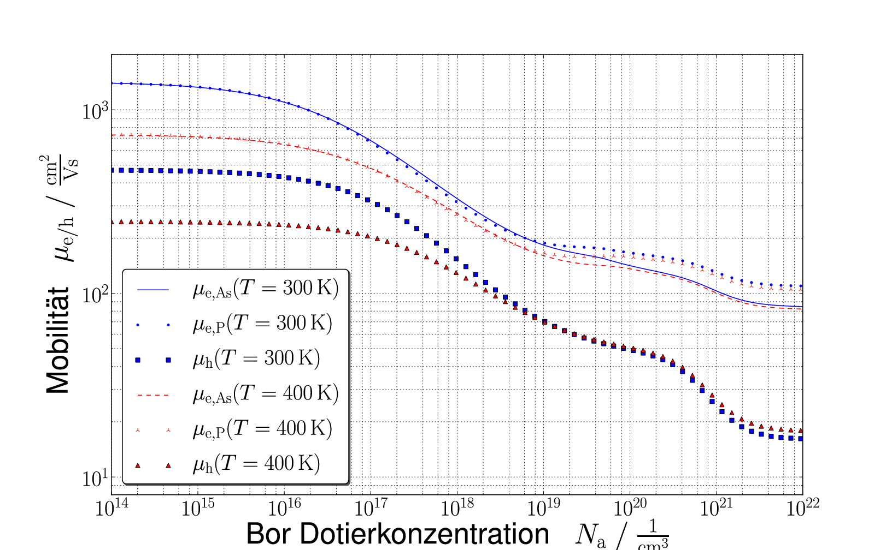
<figcaption>P-type silicon carrier mobilities (left) temperature dependent with doping concentration as parameter and (right) doping concentration dependent with temperature as parameter.</figcaption>
</figure>
<figure>
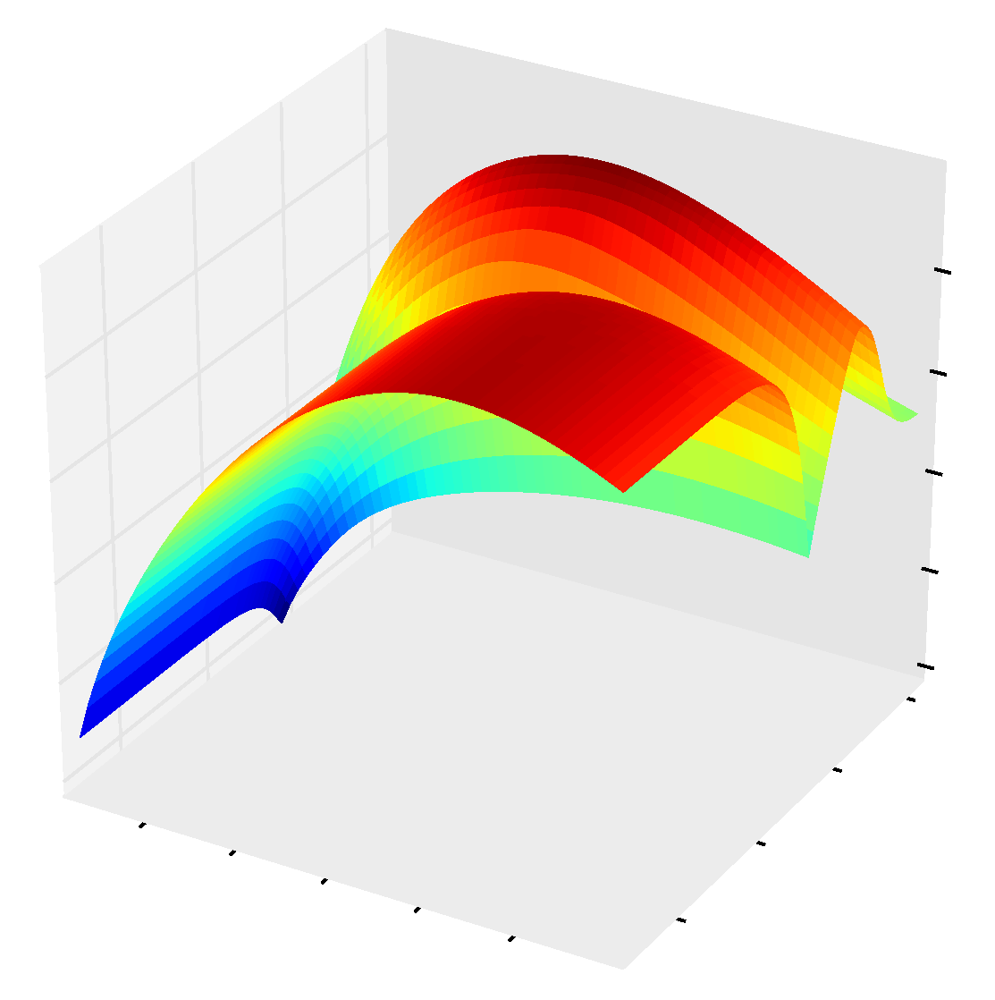
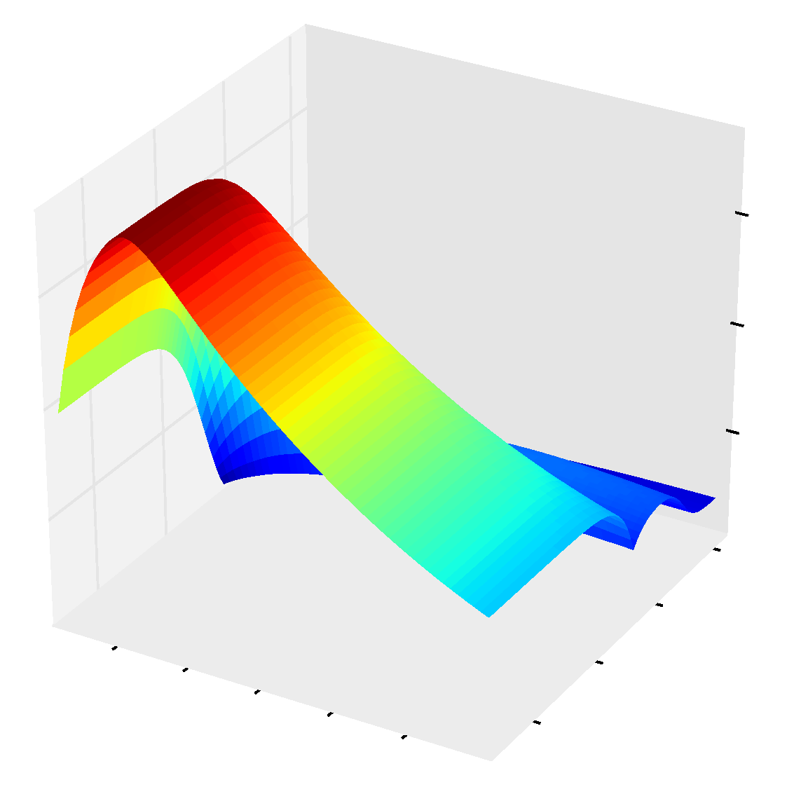
<figcaption>3D Graph of p-type silicon (left) temperature and B-doping dependent electron mobilities and (right) temperature and B-doping dependent hole mobilities.</figcaption>
</figure>
 

### 7 - Diffusion Coefficients

- Implementation of the Einstein–Smoluchowski equation
    - for temperature independent carrier mobilities μ = μ(300 K)
    - for temperature dependent carrier mobilities μ = μ(T)

<pre>
&nbsp;&nbsp;&nbsp;&nbsp;&nbsp;&nbsp;&nbsp;&nbsp; 
&nbsp;&nbsp;&nbsp;&nbsp;&nbsp;&nbsp;&nbsp;&nbsp;  
&nbsp;&nbsp;&nbsp;&nbsp;&nbsp;&nbsp;&nbsp;&nbsp; 
&nbsp;&nbsp;&nbsp;&nbsp;&nbsp;&nbsp;&nbsp;&nbsp; 
</pre>

<figure>
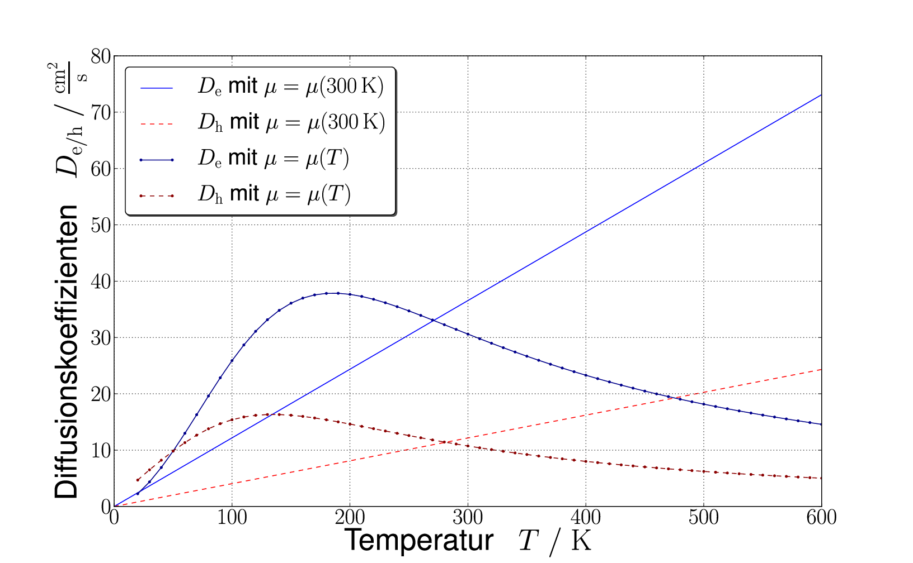
</figure>
  

## II - Two-Diode-Model

<figure>
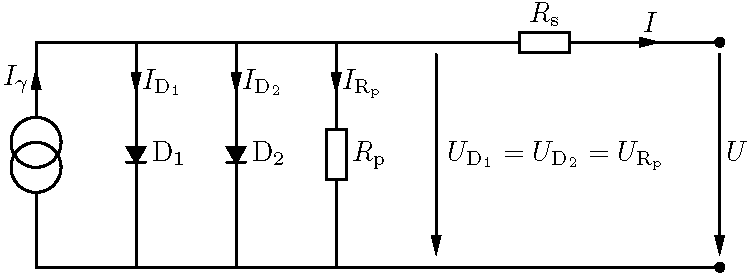
</figure>

The analytic form of the current density-voltage characteristic J(U) is

<figure>
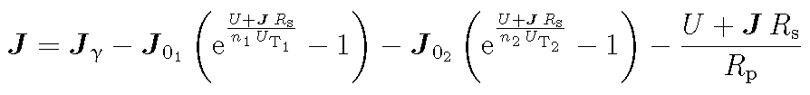
</figure>

With the provided two-diode-model one can calculate the 

- Current density-voltage characteristic J(U)
- Power-voltage characteristic P(U)
- Specific solar cell characteristics like

    - Open-circuit voltage
    - Short-circuit current density
    - MPP-characteristics (voltage, current density, surface power density)
    - Fill Factor
    - Efficiency

of Silicon solar cells after defining which of the above parameters are to set as temperature in-/dependent. 
 

<figure>
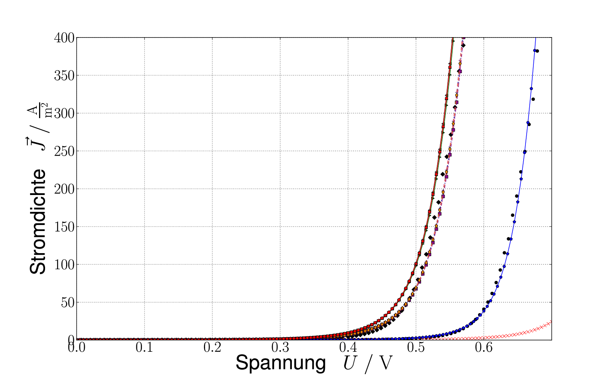
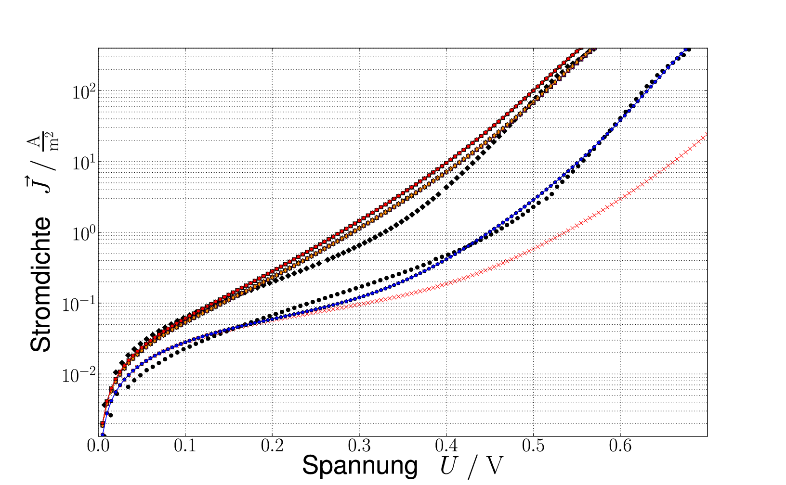
<figcaption>J(U) characteristic of different parameter combinations in (left) linear and (right) semi-logarothmic representation.</figcaption>
</figure>
  

## III - Measurement Data

In the respective folder you can find the example measurements of a Silicon solar cell at 5°C and 60°C.
The ones at 5°C were used to least square fit the initial (or fit) values which are used in the twodiodemodel.py
   

## Conventions

- The variable names in the provided Python modules represent the symbols used in the respective papers.
- I use 'U' (from latin urgere) as formula symbol for voltage.
   

## Future

<ul>
  <li>Other characteristics, parameters, alternative models of the above parameters, and also physical mechanisms exist, such as</li>

    - Temperature coefficients
    - Series resistance (semiconductor-bulk-, contact-, metallization-resistance)
    - Photocurrent density
    - Fluctuation–dissipation theorem for diffusion coefficients
    - Generation and recombination (e.g. ideality factors, surface recombination velocity, ...)
    - carrier lifetime
    - diffusion length
    - Incomplete ionization

  Some of these are already implemented. Maybe I will update this repository if I find the time and especially the muse to do so.
  <li>The provided graphs were made with Matplotlib in combination with LaTeX to render text and axes labels. This will be the topic of another repository.</li>
  <li>Perhaps I'll provide other example plot modules (if requested) to make your life easier.</li>
  <li>Feel free to contribute in any way.</li>
</ul>
  

## Software Versions

- Python 3.9.7
- NumPy 1.21.5
- SciPy 1.7.3
- Matplotlib 3.5.1

You should be able to run the modules with Python 3.x seamlessly and >2.6 after minor adjustments.
   

## License

MIT License

Copyright (c) 2022 Tobias Ried

Permission is hereby granted, free of charge, to any person obtaining a copy
of this software and associated documentation files (the "Software"), to deal
in the Software without restriction, including without limitation the rights
to use, copy, modify, merge, publish, distribute, sublicense, and/or sell
copies of the Software, and to permit persons to whom the Software is
furnished to do so, subject to the following conditions:

The above copyright notice and this permission notice shall be included in all
copies or substantial portions of the Software.

THE SOFTWARE IS PROVIDED "AS IS", WITHOUT WARRANTY OF ANY KIND, EXPRESS OR
IMPLIED, INCLUDING BUT NOT LIMITED TO THE WARRANTIES OF MERCHANTABILITY,
FITNESS FOR A PARTICULAR PURPOSE AND NONINFRINGEMENT. IN NO EVENT SHALL THE
AUTHORS OR COPYRIGHT HOLDERS BE LIABLE FOR ANY CLAIM, DAMAGES OR OTHER
LIABILITY, WHETHER IN AN ACTION OF CONTRACT, TORT OR OTHERWISE, ARISING FROM,
OUT OF OR IN CONNECTION WITH THE SOFTWARE OR THE USE OR OTHER DEALINGS IN THE
SOFTWARE.
